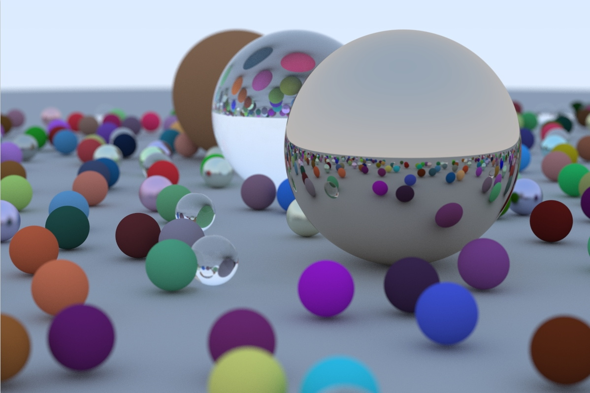

# ray-trace-learning
### 自己的光追练习.最终生成位图文件
### my-raytrace-experiment.The bitmap file will eventually be generated

### 主要参考https://raytracing.github.io/books/RayTracingInOneWeekend.html
### mainly refer to https://raytracing.github.io/books/RayTracingInOneWeekend.html

## 注意事项： notices：

- 1.看图王可以打开ppm图片.  kantuwang can open ppm file

- 2.vs版本2019兼容. visual studio version 2019 compatible
